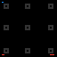
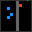
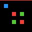

# Games

| Game | Category | Grid | Levels | Description | Preview | Actions |
|------|----------|------|--------|-------------|---------|---------|
| ez01 | Tutorial / Movement Basics | 8×8 | 5 | Go UP to reach the target. |  | • 1-4: Movement |
| ez02 | Tutorial / Movement Basics | 8×8 | 5 | Go LEFT to reach the target. |  | • 1-4: Movement |
| ez03 | Tutorial / Movement Basics | 8×8 | 5 | Go RIGHT to reach the target. |  | • 1-4: Movement |
| ez04 | Tutorial / Movement Basics | 8×8 | 5 | Go DOWN to reach the target. |  | • 1-4: Movement |
| ul01 | Puzzle Mechanics | 8×8 | 5 | Pick up the key to unlock the door and advance. |  | • 1-4: Movement |
| tt01 | Collection | 8-24 | 3 | Collection game. Navigate grid to collect yellow targets while avoiding red hazards (static collidable cells). |  | • 1-4: Movement |
| wm01 | Survival / Timing | 32×32 | 5 | Whack-a-Mole! Click moles before they escape. Meet checkpoint requirements or lose. |  | • 6: Click |
| sv01 | Survival / Timing | 8-24 | 5 | Survival game. Manage hunger and warmth. Green food restores hunger; orange warm zones stop warmth loss. Survive 60 frames to advance. |  | • 1-4: Movement • 5: Idle (wait) |
| pt01 | Pattern Puzzles | 64×64 | 5 | Pattern rotation puzzle. Click tiles to rotate them 90° clockwise and match the target pattern. |  | • 6: Click/Rotate |
| sy01 | Pattern Puzzles | 11×11 | 5 | Mirror Maker. Mirror the pattern from the left side onto the right side. Create a perfect reflection! |  | • 6: Click (place/remove block) |
| sk01 | Environmental Manipulation | 8-12 | 5 | Sokoban. Push blocks onto target pads. Green = placed. Wall blockers ramp up by level. Step limit exceeded = lose. |  | • 1-4: Movement |
| tb01 | Environmental Manipulation | 24×24 | 5 | Bridge Builder. **Multi-island** routes (waypoints + optional reef clusters); bridge open water (ACTION6), walk island-to-island to the green goal. Later levels add **max_bridges** / **step_limit**; blue ticks show level index. Swimming costs a life. |  | • 1-4: Movement • 6: Toggle bridge on water (click) |
| ff01 | Precision / Topology | 64×64 | 5 | Flood fill: click inside **closed** regions to paint them yellow. Five levels mix **rectangles**, **donut/ring**, and **C-bays** with ramping shape count. Sq01-style click ripple in final frame space; **ACTION1–4** are no-ops (pacing). |  | • 1-4: No-op • 6: Click |
| mm01 | Memory / Hidden State | 64×64 | 7 | Memory Match. Level 1 has 2 pairs, then +1 pair per level up to 8 pairs. Flip pairs of hidden tiles to find matching colors. Match all pairs to win. Time runs out = lose. |  | • 6: Click tile |
| ms01 | Memory / Hidden State | 8-16 | 5 | Blind Sapper. Navigate a hidden minefield using deduction. Safe tiles reveal adjacent mine counts. Step on a mine = lose. Reach the goal to win. Tests working memory and deductive planning. |  | • 1-4: Movement |
| sq01 | Sequencing / Ordering | 12×12 | 5 | Sequencing. Click colored blocks in the correct order. Follow the sequence shown at the top! |  | • 6: Click block |
| rs01 | Cognitive Flexibility / Rule Switching | 8-16 | 5 | Rule Switcher. Collect colored targets that match the signpost color at top. Wrong color = lose. After all colors cycle through as safe, collect remaining targets. Tests cognitive flexibility and rule adaptation. |  | • 1-4: Movement |
