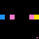
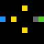
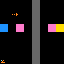
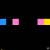
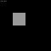

# Games

| Game | Category | Grid | Levels | Description | Preview | Actions |
|------|----------|------|--------|-------------|---------|---------|
| ez01 | Tutorial / Movement Basics | 8×8 | 5 | Go UP to reach the target. |  | • 1-4: Movement |
| ez02 | Tutorial / Movement Basics | 8×8 | 5 | Go LEFT to reach the target. |  | • 1-4: Movement |
| ez03 | Tutorial / Movement Basics | 8×8 | 5 | Go RIGHT to reach the target. |  | • 1-4: Movement |
| ez04 | Tutorial / Movement Basics | 8×8 | 5 | Go DOWN to reach the target. |  | • 1-4: Movement |
| ul01 | Puzzle Mechanics | 8×8 | 5 | Pick up the key to unlock the door and advance. |  | • 1-4: Movement |
| tt01 | Collection | 8-24 | 3 | Collection game. Navigate grid to collect yellow targets while avoiding red hazards (static collidable cells). |  | • 1-4: Movement |
| wm01 | Survival / Timing | 32×32 | 5 | Whack-a-Mole! Click moles before they escape. Meet checkpoint requirements or lose. |  | • 6: Click |
| sv01 | Survival / Timing | 8-24 | 5 | Survival game. Manage hunger and warmth. Green food restores hunger; orange warm zones stop warmth loss. Survive 60 frames to advance. |  | • 1-4: Movement • 5: Idle (wait) |
| pt01 | Pattern Puzzles | 64×64 | 5 | Pattern rotation puzzle. Click tiles to rotate them 90° clockwise and match the target pattern. |  | • 6: Click/Rotate |
| sy01 | Pattern Puzzles | 11×11 | 5 | Mirror Maker. Mirror the pattern from the left side onto the right side. Create a perfect reflection! |  | • 6: Click (place/remove block) |
| sk01 | Environmental Manipulation | 8-12 | 5 | Sokoban. Push blocks onto target pads. Green = placed. Wall blockers ramp up by level. Step limit exceeded = lose. |  | • 1-4: Movement |
| tb01 | Environmental Manipulation | 24×24 | 5 | Bridge Builder. **Multi-island** routes (waypoints + optional reef clusters); bridge open water (ACTION6), walk island-to-island to the green goal. Later levels add **max_bridges** / **step_limit**; blue ticks show level index. Swimming costs a life. |  | • 1-4: Movement • 6: Toggle bridge on water (click) |
| ff01 | Precision / Topology | 64×64 | 5 | Flood fill: click inside **closed** regions to paint them yellow. Five levels mix **rectangles**, **donut/ring**, and **C-bays** with ramping shape count. Sq01-style click ripple in final frame space; **ACTION1–4** are no-ops (pacing). |  | • 1-4: No-op • 6: Click |
| mm01 | Memory / Hidden State | 64×64 | 7 | Memory Match. Level 1 has 2 pairs, then +1 pair per level up to 8 pairs. Flip pairs of hidden tiles to find matching colors. Match all pairs to win. Time runs out = lose. |  | • 6: Click tile |
| ms01 | Memory / Hidden State | 8-16 | 5 | Blind Sapper. Navigate a hidden minefield using deduction. Safe tiles reveal adjacent mine counts. Step on a mine = lose. Reach the goal to win. Tests working memory and deductive planning. |  | • 1-4: Movement |
| sq01 | Sequencing / Ordering | 12×12 | 5 | Sequencing. Click colored blocks in the correct order. Follow the sequence shown at the top! |  | • 6: Click block |
| rs01 | Cognitive Flexibility / Rule Switching | 8-16 | 5 | Rule Switcher. Collect colored targets that match the signpost color at top. Wrong color = lose. After all colors cycle through as safe, collect remaining targets. Tests cognitive flexibility and rule adaptation. |  | • 1-4: Movement |
| pb01 | Environmental Manipulation | 8-10 | 5 | One-box push. Single crate and one goal per level; push the block onto the yellow pad. Step limit exceeded = lose. |  | • 1-4: Movement |
| fs01 | Puzzle Mechanics | 8-10 | 5 | Floor switches. Step on every yellow pressure plate (any order) to open the gray door, then reach the green goal. |  | • 1-4: Movement |
| tp01 | Puzzle Mechanics | 8-10 | 5 | Teleporters. Paired magenta portals warp you to each other; reach the yellow goal. |  | • 1-4: Movement |
| ic01 | Puzzle Mechanics | 8-10 | 5 | Ice slide. Each move slides in a straight line until a wall or red hazard stops you; reach the yellow goal. |  | • 1-4: Movement |
| va01 | Coverage / Path | 4-8 | 5 | Visit all. Walk on every walkable floor cell at least once to clear the level. |  | • 1-4: Movement |
| pb02 | Environmental Manipulation | 8-10 | 5 | Two crates, two yellow goals; push both blocks onto pads (sk01-style). |  | • 1-4: Movement |
| pb03 | Environmental Manipulation | 8-10 | 5 | Decoy orange pad — pushing a crate onto it loses; real goals stay yellow. |  | • 1-4: Movement |
| fs02 | Puzzle Mechanics | 8-10 | 5 | Floor switches **OR**: stepping on **any** plate opens the door (not all plates). |  | • 1-4: Movement |
| fs03 | Puzzle Mechanics | 8-10 | 5 | Floor switches **sequence**: plates must be stepped in **level sprite order**. |  | • 1-4: Movement |
| tp02 | Puzzle Mechanics | 8-10 | 5 | **Directed** warps only (`directed_pairs` in level data); no reverse hop from destination. |  | • 1-4: Movement |
| tp03 | Puzzle Mechanics | 8-10 | 5 | **Single-use** portals — both tiles removed after one warp. |  | • 1-4: Movement |
| ic02 | Puzzle Mechanics | 8-10 | 5 | **Torus** ice slide: wraps at grid edges until a wall/hazard stops you. |  | • 1-4: Movement |
| ic03 | Puzzle Mechanics | 8-10 | 5 | **Capped** slide: each move travels at most `slide_cap` cells (`level.data`). |  | • 1-4: Movement |
| va02 | Coverage / Path | 4-8 | 5 | Visit every **non-hazard** floor cell; red hazard cells never need coverage. |  | • 1-4: Movement |
| va03 | Coverage / Path | 4-8 | 5 | **Ordered** visit cells (`visit_order` in level data) before finishing. |  | • 1-4: Movement |
| nw01 | Puzzle Mechanics | 8-10 | 5 | Arrow tiles (`arrows` in level data) **force** the next cardinal step. |  | • 1-4: Movement |
| bd01 | Coverage / Path | 5-8 | 5 | **No revisits** — entering any cell twice loses; reach the goal. |  | • 1-4: Movement |
| gr01 | Puzzle Mechanics | 8-10 | 5 | **Gravity**: after each move, one auto-step in the level’s gravity direction. |  | • 1-4: Movement |
| dt01 | Puzzle Mechanics | 8-10 | 5 | **Waypoint** (cyan) must be stepped before the yellow goal counts. |  | • 1-4: Movement |
| wk01 | Puzzle Mechanics | 8-10 | 5 | **Weak floor**: brown tiles collapse to holes after you leave; holes are lethal. |  | • 1-4: Movement |
| rf01 | Puzzle Mechanics | 8-10 | 5 | **Mirror half-plane**: on `x >= mid`, left/right inputs are swapped. |  | • 1-4: Movement |
| mo01 | Puzzle Mechanics | 8-10 | 5 | **Momentum**: need **≥2** steps in a row before changing direction; early turn = lose. |  | • 1-4: Movement |
| zq01 | Puzzle Mechanics | 8-10 | 5 | **Zone timer**: blinking red hazard cells toggle on a fixed period (`period`, `hazard_cells`). |  | • 1-4: Movement |
| hm01 | Coverage / Path | 3-6 | 5 | **Hamiltonian** tour — every open cell **exactly once**; revisit = lose. |  | • 1-4: Movement |
| ex01 | Puzzle Mechanics | 8-10 | 5 | **Exit hold**: stand on green exit pad and repeat **ACTION5** `hold_frames` times to clear. |  | • 1-4: Movement • 5: Hold / charge exit |
| gp01 | Pattern Puzzles | 8×8 | 5 | **Grid paint**: **ACTION6** toggles yellow on cells to match gray hints; **ACTION1–4** are no-ops. |  | • 1-4: No-op • 6: Click |
| lo01 | Pattern Puzzles | 3×3–5×5 | 5 | **Lights Out**: **ACTION6** toggles a cell and its neighbors; clear all lights. **ACTION1–4** are no-ops. |  | • 1-4: No-op • 6: Click |
